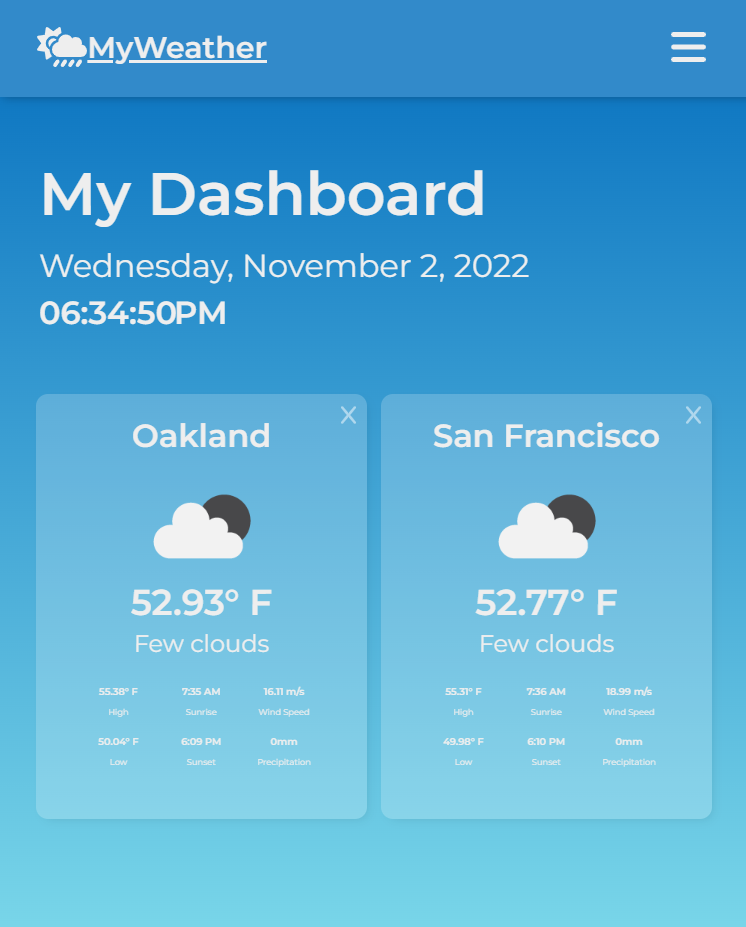
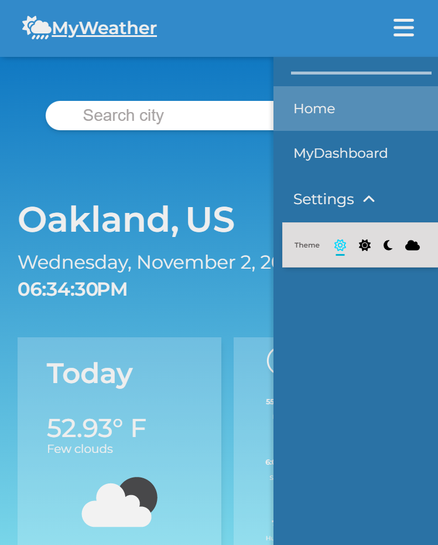
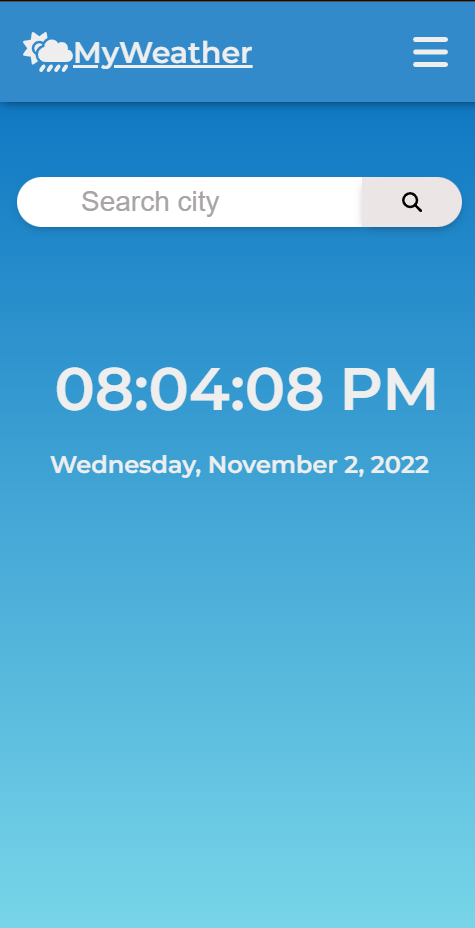
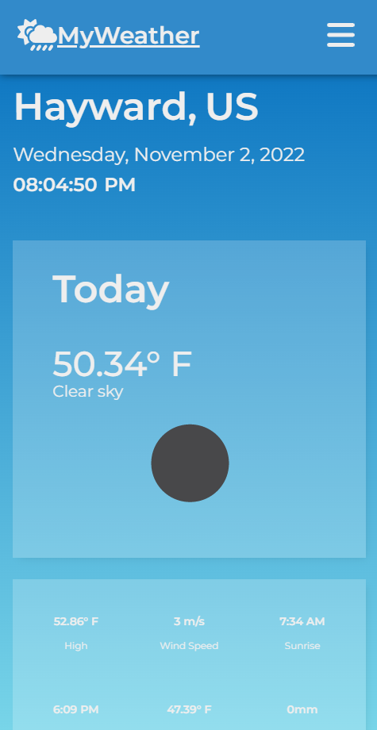

# MyWeather Application

ReactJS Weather application that displays the current weather/5-day forecast of the queried location. Users can add locations to a dashboard to view weather data of multiple locations at once.

This application fetches weather data from the OpenWeather Current Weather and 5-day 3-hour Forecast APIs (https://openweathermap.org/api).

 

---

 

# Demo #

  

 

---

 

# Features #
## Home view ##
Displays the current date and time.

## Location searchbar ##
Users can view the current weather and 5 day forecast for a location using the searchbar. Invalid input is indicated when there searchbar is empty or an invalid location.

  

## Current Weather Display ##
Shows the city and country of the location. There are two main display cards: 
* Today's current weather conditions and temperature
* Extra weather details: high/low temperatures, wind speed, humidity,  sunrise/sunset, and precipation for the past 1-3 hours

## 5 Day Forecast ##
Displays the weather forecast for the next 5 days with extra details.

## Dashboard ##
Users can add locations they want to save on a dashboard. All weather info in the current weather display is included on each dashboard card. Users can delete locations from the dashboard.

## Theme selector ##
Four different themes are available to select from the settings:

|Day | Evening |
|----|---------|
|||
| | |
|
Night
 | 
Cloudy
 |

 

---

 

# Device Responsiveness #
## Desktop ##
|  |  | 
|----|---------|
|  |  | 

## Tablet ##
|  |  | 
|----|---------|
| 

 | 

| 
|

|

## Mobile ##
|  |  | 
|----|---------|
| 

| 

 | 
|

 |

